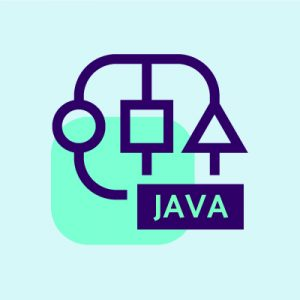

# Java POO

O repositório é composto do curso Java POO do canal **Curso em Vídeo**, do professor Gustavo Guanabara realizado em 2016. O curso aborda a orientação a objetos, onde há uma aula de teoria e outra prática. Este repositório apresenta apenas as partes práticas, enquanto as teóricas anotei em outro repositório meu, de nome "Nunca Pare de Aprender". 

:warning: O conteúdo é oriundo do material do <a href="https://gustavoguanabara.github.io" style="text-decoration:none">repositório do GitHub de Gustavo Guanabara</a>, que foi disponibilizado e autorizado os usos do mesmo para ensino básico para alunos iniciantes para fins educacionais, desde que cite a autoria. O material não poderá ser utilizado para ganhos financeiros e/ou sem a indicação da autoria.

> Status do projeto: Em andamento :pencil:

